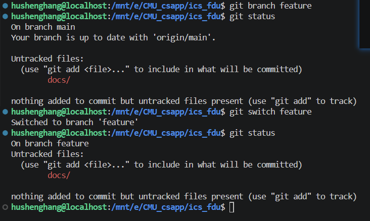

# Lab0：GitLab 实验报告

## 1. Git 基础问题

认真阅读[文档](https://ics-26fall-fdu.github.io/labs/lab0-git-lab/)，学习 Git 的基本用法，并在报告中回答文档中的问题。（15 分）

- 你之前有过多人协同开发的经历吗？如果有，你们是使用什么方式分工协作的？

  A: 有过共同开发经历， 当时使用的是微信hub作为版本控制工具（bushi）。当时还没有接触github， 只能是我写完， 然后压缩，发给另一个同学， 然后她再来改；
  也有优点吧， 非常的新手友好， 缺点就是超过1G就传不过去了。。

- 思考一下，Git 为什么要设计“暂存-提交”两个步骤？

  A: 我认为是给开发者更多的灵活性吧， 比如我想先提交哪些文件， 就可以放到暂存区， 然后把需要提交的一起commit掉， 就很方便~~。 至于还没测试好的就可以放在更改中， 先不提交（个人观点

- `git branch` 和 `git branch -a` 的区别是什么？查阅资料并回答。

  A: `git branch` 只会显示本地分支， 而 `git branch -a` 会显示本地分支和远程分支。

## 2. 修改并提交 `main.c`

2.已完成√

## 3. 拓展阅读与思考

### 3.1 Commit Message 规范

[《Commit Message 和 Change Log 编写指南》](https://www.ruanyifeng.com/blog/2016/01/commit_message_change_log.html)主要介绍了如何编写清晰、统一的 Git 提交信息。文章参考 Angular 团队的规范，将 Commit Message 分为 Header、Body 和 Footer 三部分，其中 Header 包含 `type`、可选的 `scope` 和简短的 `subject`。

`type` 用来说明提交的类别，例如 `feat` 表示新增功能、`fix` 表示修复问题、`docs` 表示只修改文档、`refactor` 表示代码重构。Body 用于补充修改的原因、实现方式以及与原行为的差异；Footer 可以记录不兼容变更或关闭的 Issue。对于撤销已有提交，文章还介绍了 `revert` 类型。

统一的 Commit Message 不只是为了格式整齐。它可以帮助开发者快速理解每次修改、筛选提交历史，并为自动生成 Change Log 和判断版本号变化提供基础。在多人协作中，这种规范也能降低沟通成本。

### 3.2 Git Flow 分支控制

[《Gitflow 使用规范》](https://www.dafaycoding.com/article/git-gif-flow)介绍了一种以分支为核心的 Git 协作流程。Gitflow 会让不同分支承担不同职责：`master`（或现在常用的 `main`）用于保存可以发布的稳定版本，`develop` 用于整合日常开发成果；开发新功能时从 `develop` 创建 `feature` 分支，准备发布时创建 `release` 分支，线上版本出现紧急问题时则从稳定分支创建 `hotfix` 分支。

功能完成后，`feature` 分支会合并回 `develop`；发布准备完成后，`release` 分支会合并到稳定分支和 `develop`；`hotfix` 修复完成后也需要合并回相关分支，避免后续版本再次出现相同问题。这样的分工可以隔离尚未完成的功能和稳定代码，使开发、测试、发布及紧急修复能够有序进行。

### 3.3 为什么要学习 Git

在以前使用“压缩文件 + 微信传输”的协作方式时，最明显的问题是版本容易混乱：文件名可能出现“最终版”“最终版 2”“真的最终版”等情况，而且很难追踪某处代码是谁在什么时候修改的。如果两个人同时编辑同一个文件，手动比较和合并也很麻烦。

Git 能为每次修改保留作者、时间、说明和内容差异，使项目历史清晰可查；出现问题时，可以利用提交记录定位原因或恢复到之前的版本。分支则让不同成员可以相对独立地开发功能，在适当的时候再合并，减少互相覆盖代码的风险。

因此，学习 Git 不只是学习若干命令，更重要的是掌握一种可靠的版本管理和协作方法。即使是个人项目，Git 也能记录思路和修改过程；在多人项目中，它更是分工、审查、测试和发布代码的重要基础。

## 4. 分支管理与冲突处理

### 4.1 创建并切换分支

在 `main` 分支创建 `feature` 分支，然后切换到该分支：

```bash
git branch feature
git switch feature
```



### 4.2 在两个分支分别修改并提交

在 `feature` 分支中向 `main.c` 添加：

```c
printf("this is feature branch\n");
```

随后切换回 `main` 分支，在同一位置添加不同内容：

```c
printf("this is main change\n");
```

两个分支修改了同一处代码，Git 无法自动判断应该采用哪一种修改，因此合并时产生了冲突。

### 4.3 合并并解决冲突

在 `main` 分支执行：

```bash
git merge feature
```

Git 提示 `main.c` 存在内容冲突：


打开文件后，可以看到 `<<<<<<< HEAD`、`=======` 和 `>>>>>>> feature` 三类冲突标记。它们分别标出了当前 `main` 分支的内容、分隔线以及 `feature` 分支的内容。


比较两部分修改后，保留 `main` 分支中的输出语句，并删除另一条语句以及所有冲突标记。随后执行：

```bash
git add main.c
git commit
```

其中，`git add main.c` 表示冲突已经手动解决，`git commit` 则完成这次合并提交。

### 4.4 一些说明

1. 文档说明在docs/lab0-git-lab/，

2. 图片截图在docs/lab0-git-lab/images/，

3. 大部分手搓 有不对的地方请指出！！！

感谢老师们给出这么精彩全面的实验和说明文档， 很有帮助。
